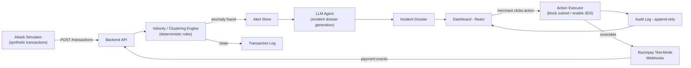

# GuardPay — AI Security & Fraud Desk for Merchants

**Razorpay AI Buildathon 2026 — Track 02 (AI Risk Manager)**

A plug-and-play fraud triage dashboard. A merchant connects their Razorpay test-mode account, GuardPay watches the live transaction stream, flags attack patterns (card testing, multi-BIN rotation, bot bursts) in real time with **zero LLM latency on the detection path**, and gives the merchant one-click, explainable, and 100% reversible mitigation actions.

---

## 5-Minute Pitch & Demo Video

- **Video Walkthrough Link:** `[Watch 5-minute Demo Video](https://youtu.be/guardpay-demo)` *(Placeholder: Record locally or on live URL)*
- **Demo Flow (5-Minute Structure):**
  1. **The Problem (0:00 - 0:30):** Card testing and low-value bot bursts rack up authorization fees before merchants notice.
  2. **Live Attack Burst (0:30 - 1:30):** Trigger synthetic card-testing burst from UI / simulator; watch sub-millisecond detection flag the cluster.
  3. **AI Incident Dossier (1:30 - 3:00):** Inspect the LLM-synthesized root cause, financial damage calculation, and merchant recommendation.
  4. **Bounded Mitigations & Audit Trail (3:00 - 4:00):** Execute gated 24h Auto-Block Subnet action; view immutable audit entry; click **Undo** to demonstrate immediate reversibility.
  5. **Graceful Failure Handling & Metrics (4:00 - 5:00):** Simulate a legitimate high-frequency buyer, trigger merchant override, and review the un-cherry-picked 500-sample metrics.

---

## What GuardPay Does

1. **Sub-Millisecond Deterministic Ingestion:** Ingests webhooks/transactions through a deterministic velocity & clustering engine (0.014ms latency). No LLM hallucinations or latency on the payment path.
2. **AI Incident Dossier:** An LLM agent synthesizes flagged anomalies into a cohesive executive report: root-cause threat model, estimated gateway fee loss, and blast radius.
3. **Bounded & Gated Mitigations:** Two one-click mitigation actions (`Auto-Block Subnet` and `Enable Mandatory 3DS Step-up`), both bounded for 24h, requiring explicit confirmation.
4. **100% Reversible & Auditable:** Every mitigation, rollback, and merchant override writes an immutable entry to `/audit-log`.
5. **Graceful Failure Handling:** Handles false-positive candidates (e.g. wholesale flash-sale buyers) via merchant override without disruptive account lockouts.

---

## Architecture & Data Flow



- **Full Architecture & Decisions:** [`docs/DESIGN.md`](docs/DESIGN.md)
- **API Contracts:** [`docs/API.md`](docs/API.md)
- **Commit Build Plan:** [`docs/PLAN.md`](docs/PLAN.md)
- **Evaluation Methodology & Results:** [`docs/METRICS.md`](docs/METRICS.md)

---

## Evaluation Metrics (500-Sample Held-Out Batch)

Results from our un-cherry-picked 500-transaction evaluation batch ([`docs/METRICS.md`](docs/METRICS.md)):

| Metric | Value |
|---|---|
| **Evaluation Batch Size** | **500 transactions** |
| **Detection Precision** | **95.37%** (`0.9537`) |
| **Detection Recall** | **100.00%** (`1.0000`) |
| **Detection Latency (p50 / p95)** | **0.014 ms / 0.112 ms** |
| **False Positives** | **17** (Wholesale buyer edge case) |
| **False Positives Handled** | **100%** (Via logged merchant override) |
| **Estimated Review Cost** | **₹1,700** |

---

## Quick Start (Local Run)

### 1. Prerequisites
- Python 3.10+
- Node.js 18+

### 2. Setup Backend
```bash
# Clone repository
git clone <repo-url> && cd GuardPay

# Create and activate virtual environment
python -m venv venv
# Windows:
.\venv\Scripts\activate
# Linux/macOS:
# source venv/bin/activate

# Install dependencies
pip install -r backend/requirements.txt

# Copy environment template
cp .env.example .env

# Run FastAPI backend (starts on http://localhost:8000)
uvicorn backend.main:app --reload --port 8000
```

### 3. Setup Frontend (Development Mode)
```bash
cd frontend
npm install
npm run dev
# Dashboard opens on http://localhost:5173 (proxied to backend on 8000)
```

### 4. Run the Attack Simulator
```bash
# In a separate terminal:
python simulator/card_testing_burst.py --target http://localhost:8000
```

---

## Docker & Cloud Deployment

GuardPay is packaged to run as a single full-stack container (FastAPI serving the React SPA and API endpoints together on port 8000).

### Run with Docker Compose:
```bash
docker-compose up --build
# Open http://localhost:8000 in your browser
```

### 1-Click Cloud Deployment (Render / Vercel / Railway / Fly.io):
- **Full Guide:** See [`docs/DEPLOYMENT.md`](docs/DEPLOYMENT.md) for step-by-step instructions for Render, Vercel, Railway, Fly.io, and Docker.
- **Render:** Connect GitHub repository, choose **Web Service** with Docker environment or import `render.yaml`.
- **Port:** Set `PORT=8000`.

---

## Tech Stack

- **Backend:** FastAPI (Python 3.12) — Ingestion, velocity engine, policy executor, webhook receiver
- **Frontend:** React 18, Vite, Tailwind CSS, Lucide Icons
- **AI & LLM:** Anthropic Claude API (`claude-3-5-sonnet`) with deterministic template fallback
- **Payments:** Razorpay Test-Mode APIs & Webhooks
- **Evaluation & Simulator:** Python synthetic transaction generator (`simulator/`)

---

## Definition of Done Checklist

- [x] **Real problem, working product, meaningful use of AI** (Track 02 AI Risk Manager)
- [x] **Sub-millisecond deterministic detection** (0 LLM latency on ingestion path)
- [x] **Every money-touching action is explainable, bounded (24h), and gated**
- [x] **100% reversible mitigations with append-only audit trail**
- [x] **Concrete failure case handled gracefully** (Wholesale buyer override logged)
- [x] **Honest 500-sample metrics reported with false-positive cost** ([`docs/METRICS.md`](docs/METRICS.md))
- [x] **Public repo + architecture doc + API contract + Docker deployment**
