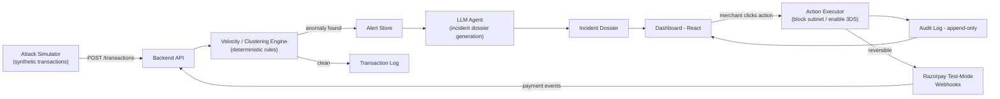

# Design & Architecture

## Problem statement

A merchant on Razorpay loses money to fraud patterns that look invisible
transaction-by-transaction but obvious in aggregate — card-testing bot
bursts, fake-return abuse, coordinated low-value attacks. By the time a
human notices the pattern in a raw transaction log, the fees and
chargebacks are already incurred. GuardPay watches the stream, detects the
pattern, explains it in plain language, and gives the merchant one bounded
action to stop it.

## Design principles

1. **Detection is deterministic, explanation is AI.** The decision to flag
   a transaction cluster never depends on an LLM call — velocity and
   clustering rules do that, fast and reproducibly. The LLM's job is to
   turn a flagged cluster into a readable incident report. This keeps the
   system auditable: you can always point to the exact rule that fired.
2. **Every money-touching action is explainable, bounded, gated.** No
   action executes without: a visible reason, a defined blast radius, and
   a human click. Nothing is fully autonomous.
3. **Every action is reversible.** Block-subnet and enable-3DS both have
   an undo path and both write to an audit log.
4. **Defense only.** Nothing in this system can be repurposed to identify
   or exploit fraud techniques offensively — it detects and mitigates,
   it does not simulate novel attack methods beyond the basic testing
   patterns needed to build and evaluate the detector.

## System diagram

## Data flow — single incident, step by step

1. `Attack Simulator` or real Razorpay webhook sends transaction events to
   the backend at a burst rate.
2. `Velocity Engine` evaluates each transaction against rolling windows:
   txn count per card per minute, BIN clustering across recent
   transactions, IP/subnet clustering. Thresholds are config values, not
   hardcoded, so they can be tuned per merchant.
3. On threshold breach, an `Alert` object is created and persisted
   (severity, pattern type, affected BIN/subnet, transaction ID list,
   timestamp).
4. The `LLM Agent` receives the alert plus its supporting transaction data
   and produces an `Incident Dossier`: root-cause narrative, estimated fee
   damage, blast radius, and a plain-language summary for a non-technical
   merchant.
5. The dashboard renders the dossier with two buttons. Each button shows
   its exact effect before the merchant clicks (e.g. "This will decline
   all future transactions from subnet 103.21.xx.xx for 24h — reversible
   from Audit Log").
6. On click, the `Action Executor` performs the action, writes an
   `AuditLog` entry (actor: merchant, action, reason, timestamp,
   reversible-until), and updates Razorpay-side config where applicable.

## Components

| Component | Responsibility | Notes |
|---|---|---|
| Attack Simulator | Generate synthetic fraud bursts for dev/demo/eval | Configurable rate, BIN/IP variance |
| Backend API | Webhook ingestion, orchestration | FastAPI |
| Velocity Engine | Deterministic anomaly detection | No LLM in this path — keeps detection fast and auditable |
| LLM Agent | Incident narrative generation only | Never decides whether to flag |
| Action Executor | Executes bounded, reversible mitigations | Every call logged |
| Audit Log | Append-only record of every action | Source of truth for "explainable" requirement |
| Dashboard | Merchant-facing UI | Alert feed, dossier view, action buttons, audit trail |

## Track 02 (AI Risk Manager) justification

GuardPay directly addresses the core mandate of **Track 02 — AI Risk Manager**: transforming passive risk monitoring into an active, explainable, merchant-in-the-loop defense cockpit.

1. **Meaningful Use of AI**: Rather than using an LLM as an un-auditable "black box" classifier on the hot payment path, GuardPay applies AI precisely where human cognition is bottlenecked — synthesizing dozens of distributed transaction metrics into a cohesive Incident Dossier, quantifying financial blast radius, explaining the threat model to a non-technical merchant, and recommending targeted mitigation.
2. **Deterministic Risk Ingestion**: High-throughput payment processing requires sub-millisecond, reproducible anomaly detection. Velocity and clustering rules provide zero-latency detection without hallucination risks.
3. **Explainable, Bounded, Gated Mitigations**: Merchants retain sovereign control over risk actions. Each mitigation (e.g. subnet block or 3DS step-up) clearly articulates its blast radius and duration, requires merchant confirmation, and records an immutable audit trail.
4. **Resilience & Reversibility**: False positives are an inevitable reality of fraud mitigation. GuardPay ensures zero irreversible business damage through one-click mitigation rollbacks and logged merchant false-positive overrides.

## Key design decisions

- **Why deterministic detection, not end-to-end LLM?** An LLM deciding
  whether to block a merchant's real customer is a liability and hard to
  audit. Deterministic rules are transparent, fast, and give a stable
  false-positive rate you can actually measure. The LLM is used where it's
  strong — turning structured signals into a human-readable explanation.
- **Why bounded actions instead of full autonomy?** The brief explicitly
  requires every money action to be explainable, bounded, and gated. A
  merchant must be able to see the blast radius and reverse the action.
- **Why synthetic data?** Real fraud data isn't available in test mode.
  The simulator generates labeled attack + normal traffic so precision/
  recall can be measured honestly against a held-out batch, per the
  buildathon's evaluation bar.

## Known failure case handled explicitly

**False positive on a legitimate high-frequency buyer** (e.g. a business
customer making several small purchases quickly). Handling: the dossier
flags this as lower-confidence when the transaction pattern lacks BIN/IP
diversity typical of bot attacks, and the merchant can override the flag
from the dashboard — the override itself is logged in the audit trail as
a data point for tuning thresholds.

## What's out of scope for this build

- Real production Razorpay account integration (test-mode only)
- Multi-merchant tenancy / auth beyond a single demo account
- Attack pattern types beyond card-testing bursts and basic fake-return
  abuse (documented as future work, not built)
